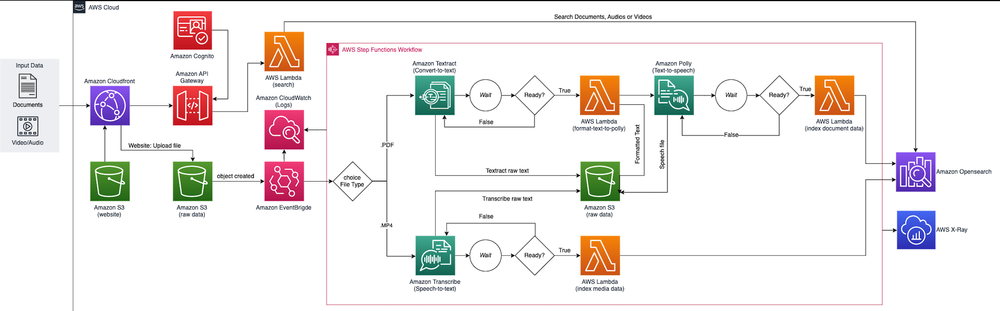

# Accessibility Document Media Searcher

## Overview

This repo intends to deploy an solution that process multiple files (.pdf, .mp4, .txt) and convert than to audio files. The solution also add those files contents into an Amazon Open Search Service to create a searchable base of contents. 

*** 

## Prerequisites:

- [awscli](https://docs.aws.amazon.com/cli/latest/userguide/cli-chap-install.html)
- [Pre configured AWS credentials](https://docs.aws.amazon.com/cli/latest/userguide/cli-configure-envvars.html)
- [npm](https://docs.npmjs.com/downloading-and-installing-node-js-and-npm)
- [cdk](https://docs.aws.amazon.com/cdk/latest/guide/getting_started.html)
- [Python 3x](https://www.python.org/downloads/)

## 1. How to deploy

### 1.2. Configure Environment Variables

```
export EMAIL="YOUR-EMAIL@SOMETHING.COM"
export REGION="us-east-1"
export VOICE_ID="Vitoria"
```

### 1.3. Deploy the CDK Stack

Clone this repo: 

```sh
git clone https://<<repo>>/accessibility-document-media-searcher.git 
```

Download the requirements: 

```
cd accessibility-document-media-searcher/source/deploy/cdk/ 
python3 -m venv .env
source .env/bin/activate
pip install -r requirements.txt
pip install -r lambda-requirements.txt --target ../../lambda/
cdk synth
cdk bootstrap
```

and after check what will be deployed, run: 

```sh 
cdk deploy 
``` 

### How it Works

The CDK deploy will create the entire stack to upload, process and convert the files into audio and searchable text. 

# Architecture




## 2. Test Your Application 

1. Log into the solution
2. Upload the file 
3. Search the result 
4. Download the audio generated 

## 3. Cleaning UP

Run the following command:

```sh
cdk destroy
```

## 4. Security

See [CONTRIBUTING](CONTRIBUTING.md#security-issue-notifications) for more information.

## 5. License

This library is licensed under the MIT-0 License. See the LICENSE file.
